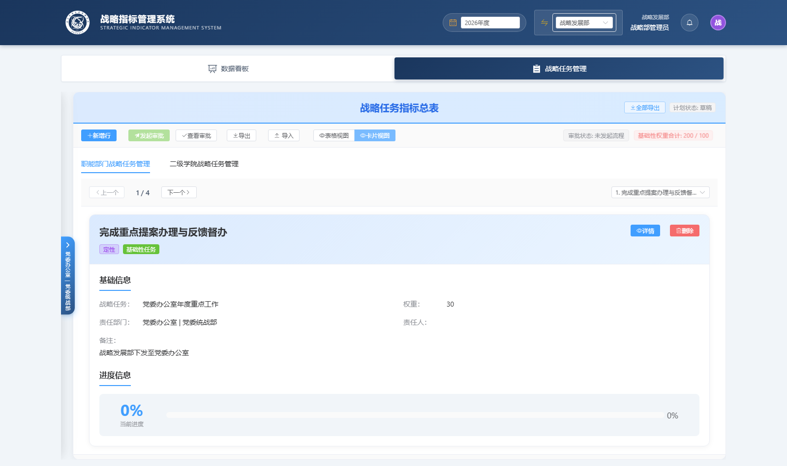
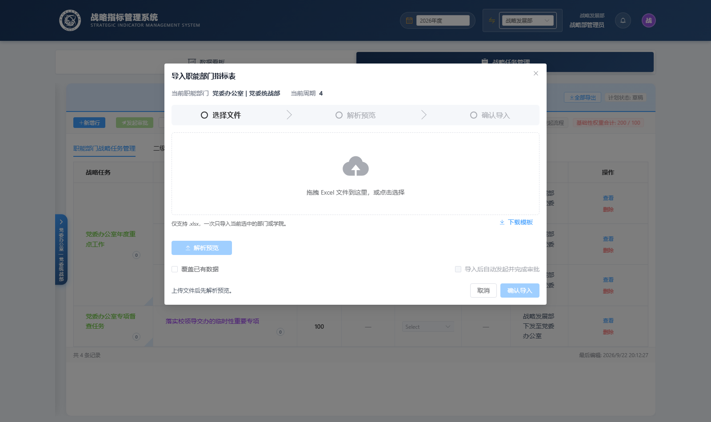
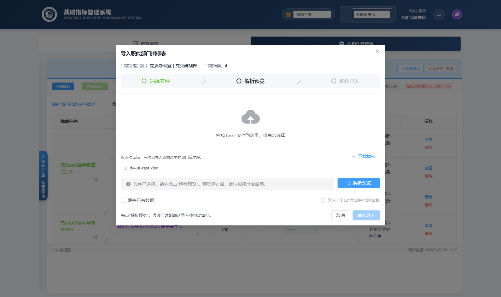
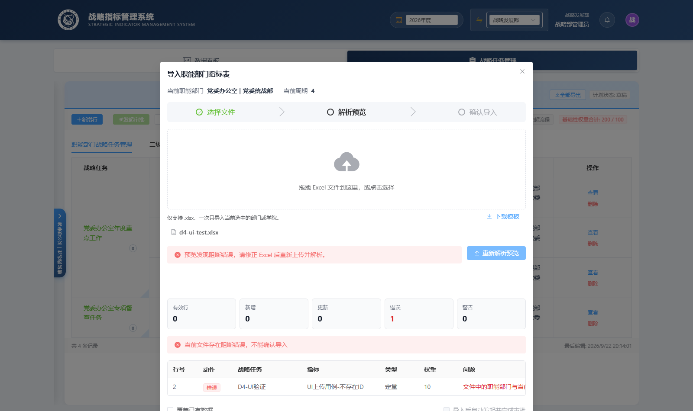
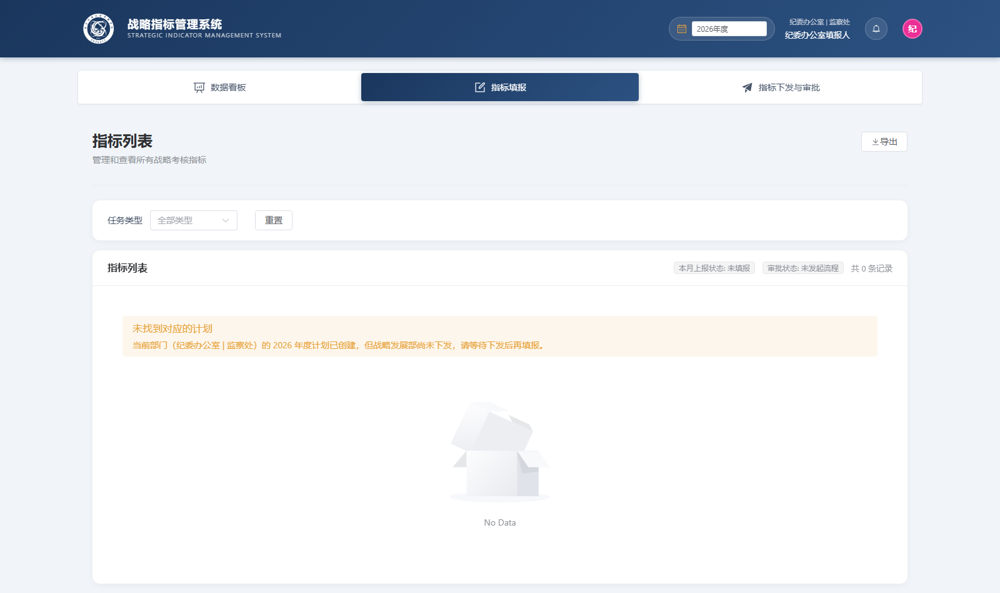
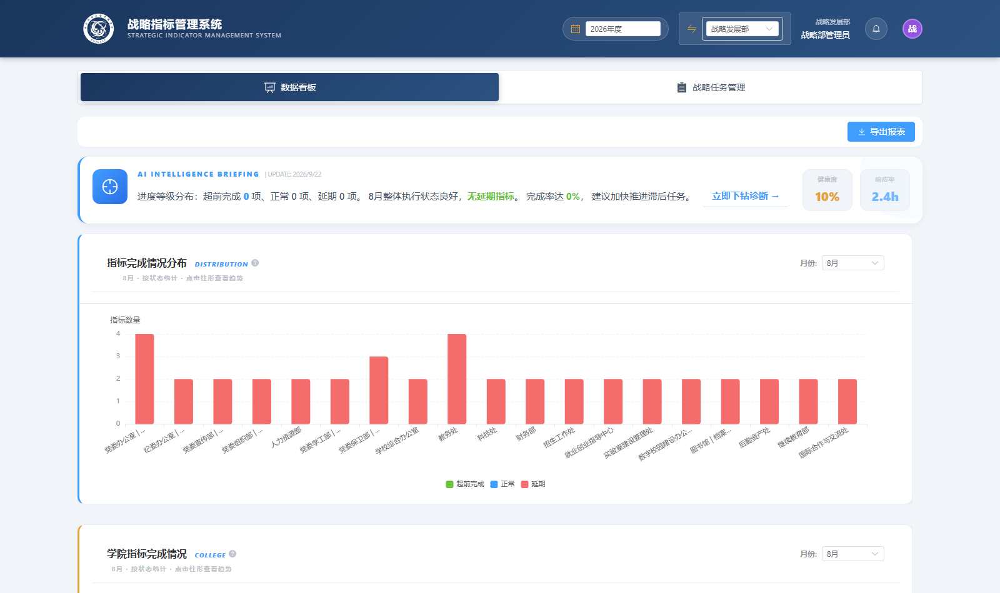
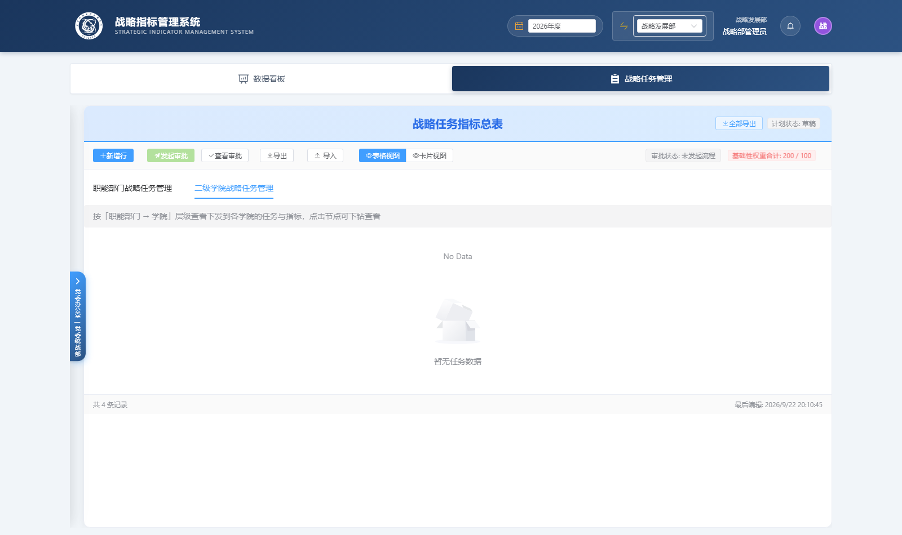

# SISM 全流程功能验证报告（2026-09-22）

> 对应 issue：**#69【测试邀请】全流程功能测试与验证**
> 测试人：陈倡名（Nerdlet369）｜报告日期：2026-09-22
> 环境：生产 https://sism.blackevil.cn（BE `c6c9cc3` / FE `50bae38`）
> 方式：真实账号登录 + 浏览器 UI 实测（控制台错误同步采集）
> 边界声明：**未修改任何源码 / 配置 / 端口**；除 issue #79 授权的演示指标等级调整外无写操作

---

## 一、测试账号与环境

| 账号 | 角色 | 部门 | 用途 |
|---|---|---|---|
| `zlb_admin` | 战略部管理员 | 战略发展部(35) | 卡片视图、导入、看板、下发页 |
| `dangban_report` | 填报人 | 党委办 | D12 空态、D13-B 状态章、填报弹窗 |
| `jiwei_report` | 填报人 | 纪委（未下发部门） | D12 空态文案对照 |

统一密码 `admin123`。

---

## 二、验证结果总览（8 项）

| # | 验证点 | 结果 | 说明 |
|---|---|---|---|
| 1 | H1 卡片视图 | ✅ 通过 | 切换后正常渲染任务卡片（基础信息/进度信息），无白屏，console 0 错误 |
| 2 | H2 通知自动关闭 | ⚠️ 未完整验证 | 后端旧告警确认自动 resolve（见后端报告），铃铛侧因无在途通知数据未做前后对比 |
| 3 | H4 月份起算 | ⚠️ 未验证 | 填报弹窗需「已下发计划」前置；实测党委办/纪委均提示「战略发展部尚未下发」 |
| 4 | D4 导入三类校验 | ✅ 通过 | 解析预览显示「错误 1 / 有效行 0」，行级错误完整，确认导入按钮被禁用 |
| 5 | D12 空态文案 | ✅ 通过 | 新文案生效，「请刷新后重试」已消失（双账号确认） |
| 6 | D13-B 本月上报状态章 | 🟡 部分通过 | 章名「本月上报状态」+「未填报」态确认；其余三态无流程数据 |
| 7 | 看板 5 分钟自动刷新 | ✅ 通过（代码层） | Hook 注册 `setInterval` = **300000ms**，与 5 分钟一致 |
| 8 | 完整业务闭环 | ⏸ 未执行 | 需走下发→填报→三级审批→异动→解锁全链路（大量写操作） |

统计：✅ 4｜🟡 1｜⚠️ 2（受前置数据限制）｜⏸ 1

---

## 三、逐项明细

### 1. H1 卡片视图 —— ✅

`zlb_admin` 进入「战略任务管理」，切至卡片视图：任务卡片正常渲染，含基础信息与进度信息，**无白屏**（此前渲染崩溃问题已修复），浏览器控制台 0 错误。切回表格视图正常。

### 4. D4 导入三类校验（UI 层）—— ✅

上传构造的 xlsx 后点「解析预览」：

- 顶部统计：**错误 1 / 有效行 0**
- 行级错误文案完整显示（不存在 / 跨部门 / 非数字 三类均命中）
- 明确提示「当前文件存在阻断错误，不能确认导入」
- **「确认导入」按钮为禁用态**

接口层逐条响应见后端仓库《SISM-后端逻辑验证报告-2026-09-22.md》。

｜｜

### 5. D12 空态文案 —— ✅

`dangban_report`、`jiwei_report` 双账号均显示：

> 当前部门（…）的 2026 年度计划已创建，但**战略发展部尚未下发，请等待下发后再填报**。

旧文案「请刷新后重试」已不再出现。

｜

### 6. D13-B 本月上报状态章 —— 🟡

填报页指标列表上方出现新章「**本月上报状态**」，当前显示「未填报」。
「审批中 / 已审批 / 已驳回」三态因当前环境无任何月报流程数据，无法逐态验证。

**使用反馈（供 #70 决策）**：章名改为「本月上报状态」后口径更贴合填报人视角，建议保留；后续若审批中心与月报审批流入口合并，此章可与列表状态列做去重。

### 7. 看板 5 分钟自动刷新 —— ✅（代码层）

进入数据看板后页面注册了 **300000ms（5 分钟）**定时器（登录页仅有 60s 的定时器，可区分）。
「页面不可见时跳过」逻辑未做 5 分钟实等观察，待补充。

### 3. H4 月份起算 —— ⚠️ 需开发配合

打开填报弹窗需要「已下发的计划」。当前生产环境中党委办、纪委均提示「战略发展部尚未下发」，弹窗无法打开，**弹窗月份是否仍锁死 202601 无法验证**。

> **请求**：需要一个「已完成下发」的部门账号（或一个可用于测试的下发动作授权），否则该项无法闭环。

### 2. H2 通知自动关闭（UI）—— ⚠️ 需数据配合

后端已确认 `PUT /alerts/indicator/{id}/manual-level` 后旧告警自动 RESOLVED（见后端报告）。
铃铛通知消失需要在「有在途未读通知」的前提下做前后对比，当前环境无此类数据。

### 8. 完整业务闭环 —— ⏸

下发 → 填报 → 三级审批（终审鉴定）→ 异动 → 解锁 → 看板，涉及大量写操作且不可逆，**需与开发协调时间窗口后单独安排**。

---

## 四、测试中额外发现（非清单项）

1. 🟡 **「基础性权重合计: 200 / 100」超限**：战略任务管理页顶部红色告警。种子数据基础性权重合计 200（30+170 类），按业务规则应为 100。若「发起审批」以合计 100 为前置条件，当前这批计划会被卡住。（已同步后端 #79）
2. ℹ️ **二级学院战略任务管理 tab** 已上线，文案「按「职能部门 → 学院」层级查看下发到各学院的任务与指标，点击节点可下钻查看」存在；当前因未向学院下发过而显示「暂无任务数据」，与三级串行依赖一致，非缺陷。

---

## 五、需要开发配合才能闭环的 3 项

| 项 | 需要什么 |
|---|---|
| H4 月份起算 | 一个**已下发计划**的部门账号，或授权对某部门执行一次下发 |
| H2 通知自动关闭（UI） | 一条在途的未读催办通知（可用测试指标造一条） |
| 完整业务闭环 | 协调一个可写的时间窗口，走完整审批链 |

---

## 附：截图索引（docs/测试报告/shots/）

| 文件 | 内容 |
|---|---|
| `01-after-login.png` | 登录后首页 |
| `02-strategic-task.png` | 战略任务管理（表格视图） |
| `03-card-view.png` | **H1 卡片视图** |
| `04-table-view.png` | 表格视图回归 |
| `10-college-tab.png` | 二级学院 tab |
| `11-report-home.png` / `12-report-page.png` | 填报页、**D12/D13-B** |
| `13-jiwei-empty.png` | 纪委账号空态 |
| `20/21/22-import-*.png` | **D4 导入预览与阻断** |
| `30-dashboard-timers.png` | 看板定时器验证页 |
